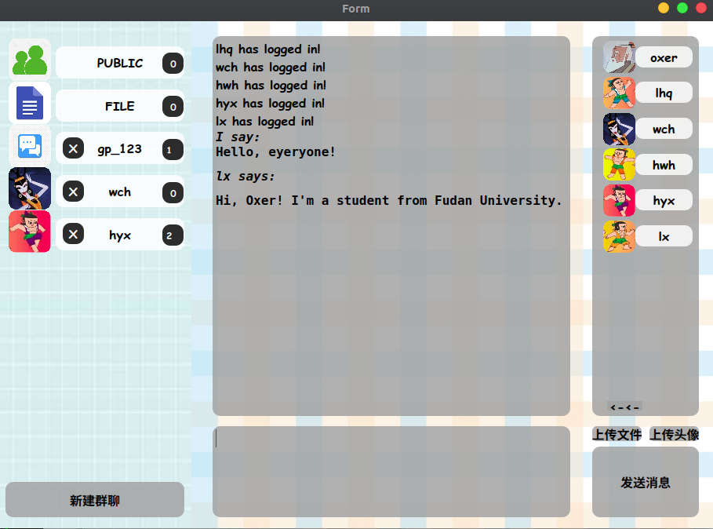

# Family of Calabash Brothers


Chatroom Project for *Computer Network* 2019 Spring @ Fudan University, by  [**Xintao Wang**](https://github.com/Nefelly) and [**Zuobai Zhang**](<https://oxer11.github.io/>)

## What's this

## How to use

### Prerequisites

```
Python 3.7
PyQt 5.0
```

### Usage

```bash
# Clone this repository
$ git clone https://github.com/Oxer11/Family-of-Calabash-Brothers.git

# Go into the repository
$ cd Family-of-Calabash-Brothers

# Run server
$ python server.py

# Run client
$ python client.py

```


## Features


